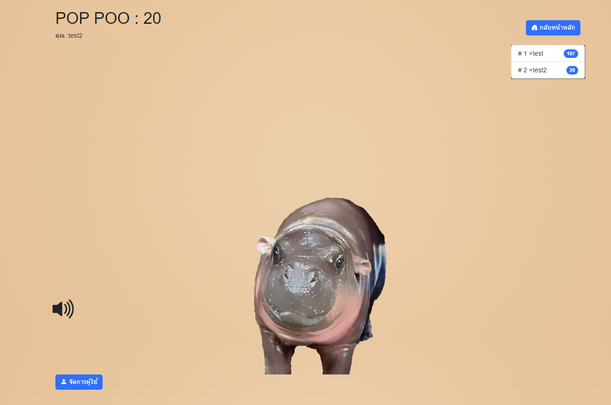
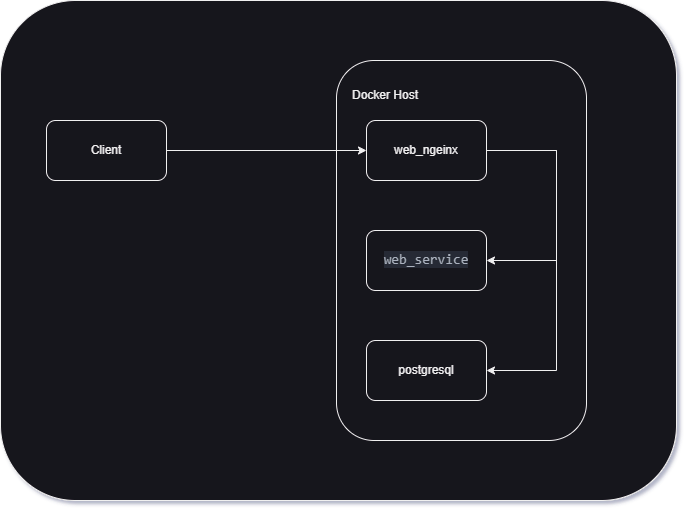
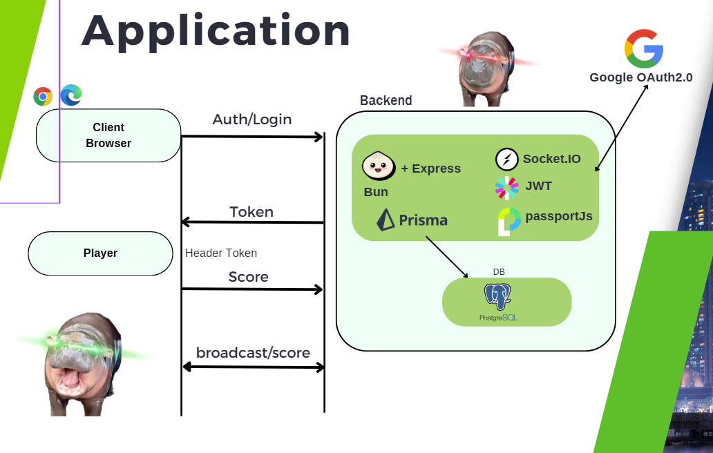

### POP POO APP
## บทนำ
poppoo คือ เป็นแอปพลิเคชันที่ถูกสร้างขึ้นเพื่อเป็นตัวอย่างการ ออกแบบ ระบบเว็บที่มีการ update ข้อมูลแบบ real-time มีระบบ login จัดอันดับ score แบบ real-time

## Technologies Used

- **Bun**: สำหรับการพัฒนา Backend
- **React**: สำหรับการพัฒนา Frontend
- **Socket.IO**: สำหรับการสื่อสารแบบเรียลไทม์
- **PostgreSQL**: ฐานข้อมูลหลักของระบบ
- **Prisma**: สำหรับจัดการ ORM และการทำงานกับฐานข้อมูล
- **Google OAuth 2.0**: สำหรับการตรวจสอบสิทธิ์ผู้ใช้งาน
- **JWT**: สำหรับการจัดการ Token ของผู้ใช้


### ตัวอย่าง 


### โครงสร้างโปรเจค
```bash
poppoo-app
├── frontend
│   ├── public
│   └── src
│       ├── components
│       ├── pages
│       ├── App.tsx
│       ├── index.tsx
│       └── ...
├── server
│   ├── src
│   │   ├── controllers
│   │   ├── models
│   │   ├── routes
│   │   ├── server.ts
│   │   └── ...
│   ├── .env
│   ├── prisma
│   │   ├── schema.prisma
│   └── ...
└── ...
```


<!-- ### คำอธิบายโครงสร้างโปรเจค
- client จะเป็นส่วนของ frontend ที่ใช้ React ในการพัฒนา
- server จะเป็นส่วนของ backend ที่ใช้ express + prisma + bun runtime ในการพัฒนา
- database จะใช้ postgresql ในการเก็บข้อมูล
- ระหว่าง client และ server จะใช้ socket.io ในการสื่อสารข้อมูลแบบ real-time
- ในการ deploy จะใช้ docker ในการสร้าง image และใช้ docker-compose ในการสร้าง container ของ client, server และ database

 -->

## System Architecture

ภาพด้านล่างแสดงการทำงานของระบบ:



---


### ส่วนประกอบหลัก

1. **Frontend (Client Browser)**
   - ผู้ใช้งานสามารถเข้าสู่ระบบและใช้งานผ่านเบราว์เซอร์
   - ดำเนินการ **Auth/Login** ผ่าน Google OAuth 2.0
   - รับ **Token** หลังจากการตรวจสอบสิทธิ์สำเร็จเพื่อนำไปใช้ในการเชื่อมต่อกับ Backend

2. **Player**
   - ส่วน Player ใช้ **Header Token** เพื่อยืนยันสิทธิ์
   - รับและส่งข้อมูลคะแนน (**Score**) ไปยัง Backend
   - ส่งการกระจายคะแนน (**broadcast/score**) ไปยังผู้เล่นอื่นในระบบแบบเรียลไทม์

3. **Backend**
   - พัฒนาโดยใช้ **Bun** และมีการใช้งานเครื่องมือและไลบรารีดังนี้:
     - **Express**: สำหรับจัดการ API
     - **Socket.IO**: สำหรับการสื่อสารแบบเรียลไทม์
     - **JWT (JSON Web Token)**: ใช้สำหรับการยืนยันตัวตนของผู้ใช้งาน
     - **Passport.js**: รองรับการตรวจสอบสิทธิ์ผ่าน Google OAuth 2.0
     - **Prisma**: ใช้จัดการฐานข้อมูล PostgreSQL

---

### การทำงานของ Backend

1. **Auth/Login**:
   - ผู้ใช้ล็อกอินผ่าน **Google OAuth 2.0**
   - ระบบจะตรวจสอบความถูกต้องและสร้าง **JWT Token** ให้ผู้ใช้สำหรับการเข้าถึงระบบ

2. **Database**:
   - ใช้ **Prisma** ในการเชื่อมต่อและจัดการฐานข้อมูล PostgreSQL
   - บันทึกและเรียกข้อมูลผู้ใช้และคะแนนที่เกี่ยวข้อง

3. **Real-Time Communication**:
   - ใช้ **Socket.IO** สำหรับการกระจายคะแนน (Broadcast) แบบเรียลไทม์
   - เมื่อมีการอัปเดตคะแนน ระบบจะส่งข้อมูลไปยังผู้เล่นคนอื่นในระบบทันที

---

## วิธีการทำงานภาพรวม
1. **ล็อกอิน**:
   - ผู้ใช้งานล็อกอินผ่าน Google OAuth 2.0 และรับ **JWT Token**
   - นำ Token ที่ได้ไปใช้ใน API ที่ต้องการการยืนยันตัวตน

2. **การส่งคะแนน**:
   - ผู้เล่นส่งคะแนน (**Score**) ไปยัง Backend
   - Backend ตรวจสอบ Token และบันทึกคะแนนลงฐานข้อมูล

3. **การกระจายคะแนน**:
   - Backend ใช้ **Socket.IO** เพื่อกระจายคะแนนแบบเรียลไทม์ไปยังผู้เล่นทุกคน

---

3. **การกระจายคะแนน**:
   - Backend ใช้ **Socket.IO** เพื่อกระจายคะแนนแบบเรียลไทม์ไปยังผู้เล่นทุกคน

---
## กระบวนการอัพเดทคะแนนผ่าน Socket (Client -> Server)

### การส่งคะแนน (Client -> Server)
1. **Event: 'update_score'**
   ```typescript
   socket.emit('update_score', {
     score: number,
     token: string,  // JWT token สำหรับการยืนยันตัวตน
     gameId?: string // รหัสเกมที่กำลังเล่น (ถ้ามี)
   });
   ```

### การรับคะแนน (Server -> Client)
1. **Event: 'score_updated'**
   ```typescript
   socket.on('score_updated', (data) => {
     // data มีรูปแบบ
     {
       userId: string,
       username: string,
       score: number,
       gameId?: string,
       timestamp: Date,
       rank: number    // อันดับปัจจุบัน
     }
   });
   ```

### การจัดการ Error
1. **Event: 'score_error'**
   ```typescript
   socket.on('score_error', (error) => {
     // error มีรูปแบบ
     {
       code: string,    // รหัส error
       message: string, // ข้อความ error
       timestamp: Date
     }
   });
   ```
---

### ขั้นตอนการทำงาน
1. ผู้เล่นทำคะแนนได้ และส่ง event 'update_score'
2. Server ตรวจสอบ token และบันทึกคะแนนในฐานข้อมูล
3. Server คำนวณอันดับใหม่และ broadcast คะแนนไปยังผู้เล่นทุกคนผ่าน event 'score_updated'
4. หากเกิดข้อผิดพลาด Server จะส่ง event 'score_error' กลับไปยัง Client
5. Client ทุกคนได้รับการอัพเดทและแสดงผลคะแนนใหม่แบบ real-time


### วิธีการใช้งาน
```bash 
git clone https://github.com/Jakkapan-a/poppoo-web.git
cd poppoo-web
docker-compose up -d --build
# หรือ
docker-compose up -d 
```

### เข้าใช้งาน
- client: http://ip_address

### โครงการนี้เป็นส่วนหนึ่งของหลักสูตร วิศวกรรมคอมพิวเตอร์
- วิชา CT648 วิศวกรรมเว็บและคลาวด์
- อาจารย์ผู้สอน ผู้ช่วยศาสตราจารย์ ดร.ชัยพร เขมะภาตะพันธ์
<!-- Link -->
Link [click-here](https://cite.dpu.ac.th/ct/master-ct/research_chaiyaporn.html).
