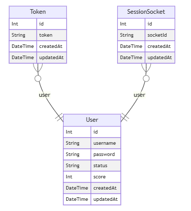

### POP POO APP
## บทนำ
poppoo คือ เป็นแอปพลิเคชันที่ถูกสร้างขึ้นเพื่อเป็นตัวอย่างการ ออกแบบ ระบบเว็บที่มีการ update ข้อมูลแบบ real-time มีระบบ login จัดอันดับ score แบบ real-time

## Technologies Used

- **Bun**: สำหรับการพัฒนา Backend
- **React**: สำหรับการพัฒนา Frontend
- **Socket.IO**: สำหรับการสื่อสารแบบเรียลไทม์
- **Prisma**: สำหรับจัดการ ORM และการทำงานกับฐานข้อมูล
- **PostgreSQL**: ฐานข้อมูลหลักของระบบ
- **Google OAuth 2.0**: สำหรับการตรวจสอบสิทธิ์ผู้ใช้งาน
- **JWT**: สำหรับการจัดการ Token ของผู้ใช้

### ตัวอย่าง 


### โครงสร้างโปรเจค
```bash
poppoo-app
├── frontend
│   ├── public
│   └── src
│       ├── components
│       ├── pages
│       ├── App.tsx
│       ├── index.tsx
│       └── ...
├── server
│   ├── src
│   │   ├── controllers
│   │   ├── models
│   │   ├── routes
│   │   ├── server.ts
│   │   └── ...
│   ├── .env
│   ├── prisma
│   │   ├── schema.prisma
│   └── ...
└── ...
```


<!-- ### คำอธิบายโครงสร้างโปรเจค
- client จะเป็นส่วนของ frontend ที่ใช้ React ในการพัฒนา
- server จะเป็นส่วนของ backend ที่ใช้ express + prisma + bun runtime ในการพัฒนา
- database จะใช้ postgresql ในการเก็บข้อมูล
- ระหว่าง client และ server จะใช้ socket.io ในการสื่อสารข้อมูลแบบ real-time
- ในการ deploy จะใช้ docker ในการสร้าง image และใช้ docker-compose ในการสร้าง container ของ client, server และ database

 -->

## System Architecture

ภาพด้านล่างแสดงการทำงานของระบบ:


diagram database
- สร้าง model สำหรับการจัดการข้อมูลผู้ใช้ คะแนน และ session ประกอบด้วยตารางต่างๆ เช่น UserDB, TokenDb, SessionSocketDb
<div align="center">
   
</div>


## รายละเอียด API ที่ใช้ในระบบ

| **#** | **Path**                           | **Methods**  | **Middlewares**                  |
|-------|------------------------------------|--------------|-----------------------------------|
| 0     | `/`                                | `GET`        | `anonymous`                      |
| 1     | `/api`                             | `GET`        | `anonymous`                      |
| 2     | `/api/auth/sign-in`                | `POST`       | `anonymous`                      |
| 3     | `/api/auth/signup`                 | `POST`       | `anonymous`                      |
| 4     | `/api/auth/check-username/:username` | `GET`       | `anonymous`                      |
| 5     | `/api/auth/check-username`         | `POST`       | `anonymous`                      |
| 6     | `/api/auth/update-username`        | `POST`       | `anonymous`                      |
| 7     | `/api/auth/delete-account`         | `POST`       | `anonymous`                      |
| 8     | `/api/auth/has-sign-in/:username`  | `GET`        | `anonymous`                      |
| 9     | `/api/auth/sign-out`               | `POST`       | `anonymous`                      |
| 10    | `/api/top-score`                   | `GET`        | `anonymous`                      |
| 11    | `/api/pop/score`                   | `GET`        | `anonymous`                      |
| 12    | `/test/:userId`                    | `GET`        | `anonymous`                      |
| 13    | `/api/auth/google`                 | `GET`        | `authenticate`                   |
| 14    | `/api/google/callback`             | `GET`        | `authenticate`, `anonymous`      |

---

## คำอธิบาย API

1. **`/`**  
   - ใช้สำหรับตรวจสอบสถานะของระบบ  
   - Method: `GET`  
   - Middleware: `anonymous`

2. **`/api`**  
   - ใช้สำหรับตรวจสอบสถานะของ API  
   - Method: `GET`  
   - Middleware: `anonymous`

3. **`/api/auth/sign-in`**  
   - ใช้สำหรับเข้าสู่ระบบและสร้าง token  
   - Method: `POST`  
   - Middleware: `anonymous`

4. **`/api/auth/signup`**  
   - ใช้สำหรับลงทะเบียนผู้ใช้ใหม่และสร้าง token  
   - Method: `POST`  
   - Middleware: `anonymous`

5. **`/api/auth/check-username/:username`**  
   - ตรวจสอบว่า username มีอยู่ในระบบหรือไม่  
   - Method: `GET`  
   - Middleware: `anonymous`

6. **`/api/auth/check-username`**  
   - ตรวจสอบว่า username มีอยู่ในระบบ (ใช้ Body)  
   - Method: `POST`  
   - Middleware: `anonymous`

7. **`/api/auth/update-username`**  
   - ใช้สำหรับอัปเดต username  
   - Method: `POST`  
   - Middleware: `anonymous`

8. **`/api/auth/delete-account`**  
   - ใช้สำหรับลบบัญชีผู้ใช้  
   - Method: `POST`  
   - Middleware: `anonymous`

9. **`/api/auth/has-sign-in/:username`**  
   - ตรวจสอบว่า username มีการเข้าสู่ระบบอยู่หรือไม่  
   - Method: `GET`  
   - Middleware: `anonymous`

10. **`/api/auth/sign-out`**  
    - ใช้สำหรับออกจากระบบ  
    - Method: `POST`  
    - Middleware: `anonymous`

11. **`/api/top-score`**  
    - ใช้สำหรับเรียกดูคะแนนสูงสุด  
    - Method: `GET`  
    - Middleware: `anonymous`

12. **`/api/pop/score`**  
    - ใช้สำหรับดูคะแนนของผู้ใช้  
    - Method: `GET`  
    - Middleware: `anonymous`

13. **`/test/:userId`**  
    - ใช้สำหรับทดสอบการเชื่อมต่อระบบ  
    - Method: `GET`  
    - Middleware: `anonymous`

14. **`/api/auth/google`**  
    - ใช้สำหรับเข้าสู่ระบบด้วย Google OAuth 2.0  
    - Method: `GET`  
    - Middleware: `authenticate`

15. **`/api/google/callback`**  
    - ใช้สำหรับการตรวจสอบสิทธิ์หลังจาก Login สำเร็จ  
    - Method: `GET`  
    - Middleware: `authenticate`, `anonymous`


### ส่วนประกอบหลัก

1. **Frontend (Client Browser)**
   - ผู้ใช้งานสามารถเข้าสู่ระบบและใช้งานผ่านเบราว์เซอร์
   - ดำเนินการ **Auth/Login** ผ่าน Google OAuth 2.0
   - รับ **Token** หลังจากการตรวจสอบสิทธิ์สำเร็จเพื่อนำไปใช้ในการเชื่อมต่อกับ Backend

2. **Player**
   - ส่วน Player ใช้ **Header Token** เพื่อยืนยันสิทธิ์
   - รับและส่งข้อมูลคะแนน (**Score**) ไปยัง Backend
   - ส่งการกระจายคะแนน (**broadcast/score**) ไปยังผู้เล่นอื่นในระบบแบบเรียลไทม์

3. **Backend**
   - พัฒนาโดยใช้ **Bun** และมีการใช้งานเครื่องมือและไลบรารีดังนี้:
     - **Express**: สำหรับจัดการ API
     - **Socket.IO**: สำหรับการสื่อสารแบบเรียลไทม์
     - **JWT (JSON Web Token)**: ใช้สำหรับการยืนยันตัวตนของผู้ใช้งาน
     - **Passport.js**: รองรับการตรวจสอบสิทธิ์ผ่าน Google OAuth 2.0
     - **Prisma**: ใช้จัดการฐานข้อมูล PostgreSQL

---

### ขั้นตอนการทำงาน
การเพิ่มคะแนน:
1. ผู้เล่นส่ง Event 'update_score' ผ่าน socket.io ไปยัง Backend
2. Backend บันทึกคะแนนในฐานข้อมูล 
3. Backend คำนวณอันดับใหม่และส่ง Event 'score_updated' ไปยังทุก Client ผ่าน socket.io

## การจัดการผู้ใช้:
1. ผู้ใช้สามารถเข้าสู่ระบบหรือสมัครใช้งานผ่าน Google OAuth 2.0
2. Token จะถูกสร้างขึ้นและส่งกลับไปยังผู้ใช้


### วิธีการใช้งาน
```bash 
git clone https://github.com/Jakkapan-a/poppoo-web.git
cd poppoo-web
docker-compose up -d --build
# หรือ
docker-compose up -d 
```

### เข้าใช้งาน
- client: http://ip_address

### โครงการนี้เป็นส่วนหนึ่งของหลักสูตร วิศวกรรมคอมพิวเตอร์
- วิชา CT648 วิศวกรรมเว็บและคลาวด์
- อาจารย์ผู้สอน ผู้ช่วยศาสตราจารย์ ดร.ชัยพร เขมะภาตะพันธ์
<!-- Link -->
Link [click-here](https://cite.dpu.ac.th/ct/master-ct/research_chaiyaporn.html).
